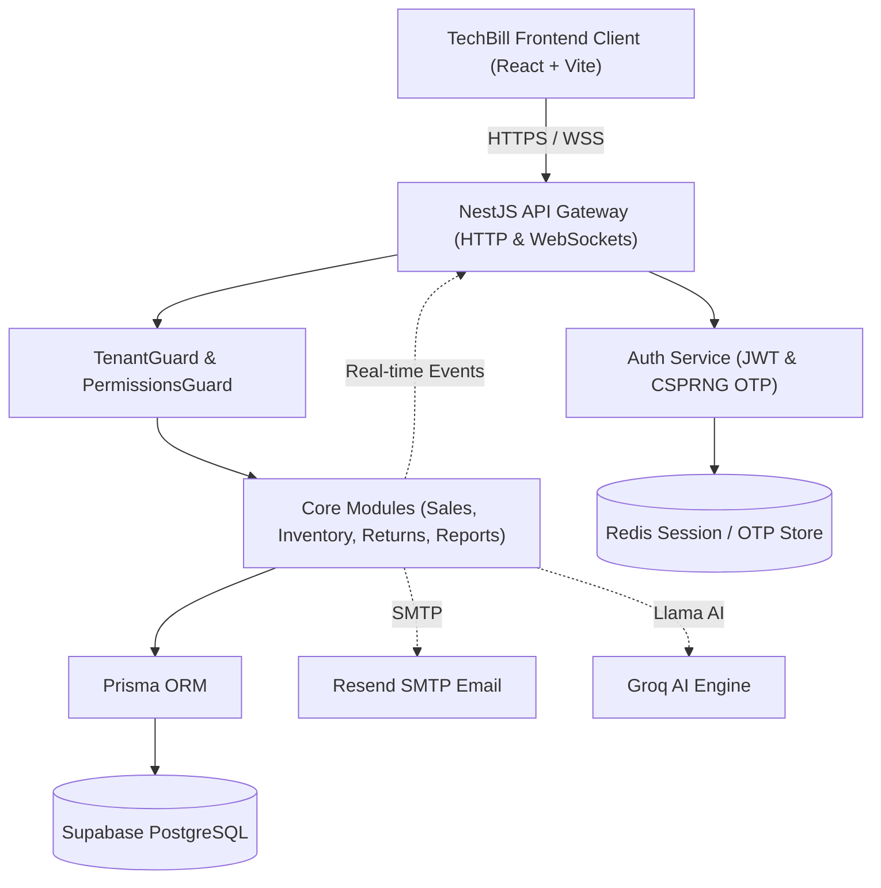

# TechBill — Enterprise ERP & Invoice Management SaaS Architecture

This document provides a comprehensive technical overview of the TechBill system architecture, data flow, security model, and implementation patterns.

---

## 1. System Overview

TechBill is a high-scale, multi-tenant SaaS Enterprise Resource Planning (ERP) and Invoice Management System built for retail enterprises. It provides real-time sales tracking, serial-number-level inventory control, dynamic warranty verification, cash reconciliation, and automated fraud detection.



---

## 2. Tech Stack

### Backend (`techbill-api`)
*   **Runtime**: Node.js 20+
*   **Framework**: NestJS 11 (progressive TypeScript framework)
*   **ORM**: Prisma 5
*   **Database**: PostgreSQL hosted on Supabase (using Session Pooler on port 5432)
*   **Caching & Session Store**: Redis via `ioredis` (with in-memory fallback for local development)
*   **Real-time Services**: Socket.IO WebSockets gateway
*   **Notification Engine**: Nodemailer (Resend SMTP integration)
*   **AI Engine**: Groq SDK (`llama-3.3-70b-versatile`)
*   **Security & Middleware**: Helmet, Throttler rate limiter, Cookie Parser, Class Validator

### Frontend (`techbill-pos`)
*   **Framework & Build Tool**: React 18 + Vite + TypeScript 5
*   **State Management**: Zustand (with persistent storage for auth and cart)
*   **UI Styling**: Tailwind CSS v3 with a custom modern dark glassmorphism ("Stitch") theme
*   **Micro-animations**: GreenSock Animation Platform (GSAP 3)
*   **Charts**: Recharts
*   **Local Caching / Offline Database**: Dexie.js (IndexedDB wrapper)
*   **PWA Wrapper**: `vite-plugin-pwa`

---

## 3. SaaS Multi-Tenancy & Data Isolation

TechBill implements a **Shared Database, Shared Schema** multi-tenancy model. Every tenant's data is logically isolated within the same database using a `tenantId` field on all tenant-owned models.

### Prisma Schema Design
The `Tenant` model holds the configuration for each subscriber:
```prisma
model Tenant {
  id               String   @id @default(uuid()) @db.Uuid
  name             String   @db.VarChar(255)
  slug             String   @unique @db.VarChar(100)
  status           String   @default("active") // active, suspended, cancelled
  plan             String   @default("trial")  // trial, basic, pro
  maxUsers         Int      @default(5)
  ...
}
```
All tenant-specific resources (e.g., `User`, `Product`, `Sale`, `Return`, `InventoryUnit`) maintain a foreign key relation to the `Tenant`:
```prisma
tenantId  String  @map("tenant_id") @db.Uuid
tenant    Tenant  @relation(fields: [tenantId], references: [id], onDelete: Cascade)
```

### NestJS TenantGuard
To ensure strict logical isolation and prevent cross-tenant data leaks, the backend uses `TenantGuard`. The guard interceptor performs the following:
1. Extracts the User's JWT token from the Request headers or cookies.
2. Validates the signature and token status (e.g., checks if the tenant status is `active`).
3. Appends the decoded `tenantId` to the Request context.
4. Enforces that all database operations query specifically by the retrieved `tenantId` (e.g., `where: { tenantId: req.user.tenantId }`).

If a tenant is suspended or cancelled, `TenantGuard` automatically terminates the request and prevents any database execution.

---

## 4. Role-Based Access Control (RBAC) & Permissions

Authorization is enforced at two levels: Role-based permissions (RBAC) and fine-grained programmatic check overrides.

### Roles
The system defines standard roles:
*   `platform_admin`: Cross-tenant super-admin (only accesses platform management/tenants list).
*   `owner`: Full access to the tenant's workspace, reports, settings, and worker permissions.
*   `cashier`: Can process transactions (POS screen) and register customers.
*   `inventory_manager`: Can add products, trigger Goods Received Notes (GRN), and track suppliers.
*   `accountant`: Focuses on reports, sales summaries, and cash reconciliations.
*   `technician`: Manages warranties and reviews units.

### PermissionsGuard
In the NestJS backend, endpoints are protected using the `@Permissions()` decorator and `PermissionsGuard`.
*   **Backend Guard**: Checks the `permissions` array embedded in the User's JWT against the required permissions of the controller route.
*   **Frontend Helpers**: The UI uses `can()`, `canAny()`, and `canAll()` from `src/lib/permissions.ts` to hide or show components (such as sidebar items, actions, or admin inputs) dynamically based on the current user's permissions.

---

## 5. Core Data Flows

### A. Point of Sale (POS) Checkout Flow
1. **Barcode/Serial Search**: The cashier scans or enters a serial number. The system performs a hotpath query using `GET /inventory/units/lookup/:serial` (targeted at `<50ms` latency).
2. **State Updates**: The unit is checked out from inventory state and added to the Zustand `cartStore`.
3. **Checkout Transaction**: Upon completing payment, the frontend sends a `POST /sales` request containing:
   *   Payment method (Cash, Easypaisa, JazzCash, Card, Bank Transfer)
   *   Customer details (auto-created by phone if new)
   *   Selected product serials and prices
4. **Transaction Integrity**: The NestJS backend executes a Prisma Transaction:
   *   Confirms each scanned serial is currently `in_stock`.
   *   Inserts the `Sale` and `SaleItem` records.
   *   Updates the `InventoryUnit` statuses to `sold`.
   *   Emits a WebSocket event (`sale_created`) to notify the owner's dashboard in real-time.

### B. Returns & Fraud Control Workflow
1. **Return Request**: A worker submits a return request via `POST /returns`. The system immediately sets the affected `InventoryUnit` status to `return_pending`.
2. **Fraud Detection Engine**: The system runs a query checking if the customer (identified by phone) has made two or more returns within the configured fraud window (default `30` days). If true, it automatically sets `suspiciousFlag: true`.
3. **Approval**: An `owner` reviews the pending return request. On approval (`PATCH /returns/:id/approve`):
   *   The system sets the unit status to `returned` or `damaged`.
   *   Updates the return record to `completed`.
   *   Emits a notification to all relevant dashboard users.

---

## 6. Real-Time WebSocket Architecture

Real-time events are driven by a centralized NestJS WebSocket Gateway (Socket.IO adapter) that listens for application events emitted by the backend modules.
*   **Rooms**: Connected clients subscribe to their specific tenant room (`shop_{tenantId}`).
*   **Events**:
    *   `sale_created`: Sends invoice metadata, transaction totals, and staff indicators.
    *   `return_requested`: Alerts the owner of a return requiring review.
    *   `low_stock_alert`: Broadcasts when a product's stock count falls below the configured threshold.
    *   `cash_submitted`: Informs the owner when cash reconciliations are submitted.

---

## 7. AI Performance Analytics

TechBill leverages the **Groq SDK** utilizing `llama-3.3-70b-versatile` for lightning-fast daily business summaries.
*   **Operation**: The `reports` service aggregates daily sales data, top products, payment distributions, and staff activity.
*   **Prompting**: This structured JSON data is processed with a system template directing the model to generate a concise, corporate executive summary.
*   **Caching**: Results are cached in Redis to minimize API roundtrips and manage Groq rate limits.

---

## 8. Offline Resilience (PWA Architecture)

To support uninterrupted store sales in poor connectivity situations:
*   **Storage**: The POS app uses Dexie.js to cache the tenant's product catalogue and inventory status locally.
*   **Offline Selling**: When offline, cart transactions are stored in an IndexedDB queue (`pending_sales`).
*   **Synchronization**: Upon connection recovery (detected via `navigator.onLine` and active pings), the queue is flushed via `POST /sales` requests to synch historical transactions with the Supabase Postgres master database.
